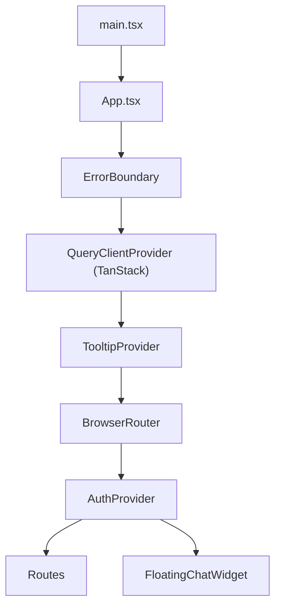
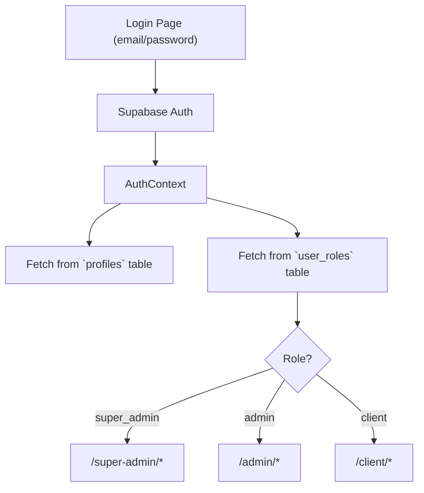
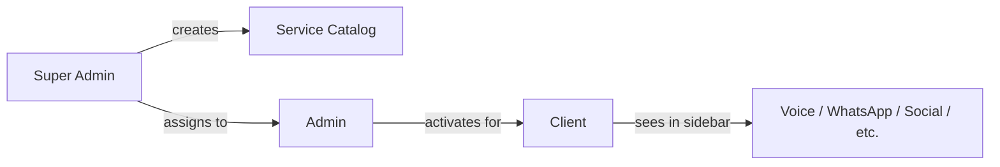
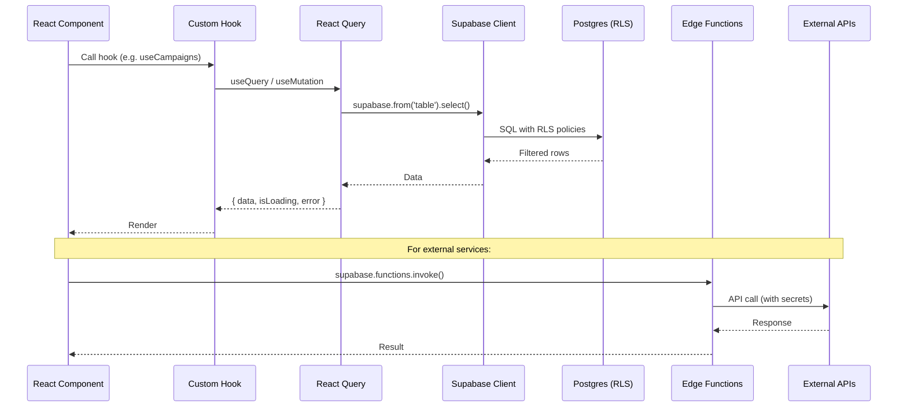
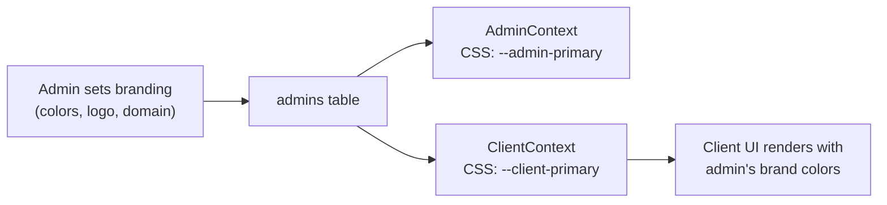

# Pixoranest SaaS — Architecture & Client-Side Walkthrough

## What Is This Project?

**Pixoranest SaaS** is a **multi-tenant, white-label AI services platform** built for resellers. It lets a platform owner (Super Admin) offer AI-powered communication services — voice telecalling, AI receptionists, WhatsApp automation, social media management — through a hierarchy of resellers (Admins) who in turn serve end-user businesses (Clients).

Think of it as a **"SaaS-in-a-box" for AI communication tools**, with built-in multi-tenancy, white-labeling, usage billing, and a full service catalog.

---

## Tech Stack

| Layer | Technology |
|---|---|
| **Framework** | React 18 + TypeScript |
| **Bundler** | Vite 5 |
| **Routing** | React Router DOM v6 |
| **Styling** | Tailwind CSS 3 + shadcn/ui (Radix primitives) |
| **State / Data** | TanStack React Query v5 |
| **Backend** | Supabase (Auth, Postgres + RLS, Edge Functions, Realtime) |
| **Animations** | Framer Motion |
| **Charts** | Recharts |
| **Forms** | React Hook Form + Zod validation |
| **PDF Export** | jsPDF + jspdf-autotable |
| **CSV Parsing** | PapaParse |
| **Workflow Automation** | n8n (external, templates in repo) |
| **PWA** | vite-plugin-pwa |

---

## Folder Structure

```
pixoranest-saas/
├── public/                          # Static assets (favicon, PWA manifest icons)
├── index.html                       # SPA entry point
├── src/
│   ├── main.tsx                     # React DOM bootstrap
│   ├── App.tsx                      # Root component: providers + routing
│   ├── App.css / index.css          # Global styles + Tailwind directives
│   │
│   ├── contexts/                    # React Context providers
│   │   ├── AuthContext.tsx          # Session, user, profile, role, logout
│   │   ├── AdminContext.tsx         # Admin-specific profile + white-label branding
│   │   └── ClientContext.tsx        # Client profile, assigned services, admin branding
│   │
│   ├── pages/                       # Route-level page components
│   │   ├── Index.tsx                # Landing / marketing page
│   │   ├── Login.tsx                # Auth page (email/password via Supabase)
│   │   ├── NotFound.tsx             # 404
│   │   ├── SuperAdminDashboard.tsx  # Super Admin shell (layout + nested routing)
│   │   ├── AdminDashboard.tsx       # Admin shell
│   │   ├── ClientDashboard.tsx      # Client shell
│   │   ├── super-admin/             # 15 pages (admins, clients, services, n8n, analytics…)
│   │   ├── admin/                   # 15 pages (clients, pricing, billing, white-label…)
│   │   └── client/                  # 24 pages (voice, WhatsApp, social, leads, billing…)
│   │
│   ├── components/                  # Reusable UI components
│   │   ├── ui/                      # 49 shadcn/ui primitives (button, dialog, table…)
│   │   ├── super-admin/             # SA-specific: forms, modals, layout, sidebar
│   │   ├── admin/                   # Admin-specific: layout, sidebar, modals, widgets
│   │   ├── client/                  # Client-specific: layout, sidebar, mobile nav
│   │   │   ├── telecaller/          # Campaign-specific sub-components
│   │   │   └── whatsapp/            # WhatsApp-specific sub-components
│   │   ├── chat/                    # Floating chat widget
│   │   ├── actions/                 # Action button components
│   │   ├── activity/                # Activity feed components
│   │   ├── csv/                     # CSV upload/parse components
│   │   ├── export/                  # Data export components
│   │   ├── filters/                 # Filter UI components
│   │   ├── services/                # Service display components
│   │   ├── skeletons/               # Loading skeleton components
│   │   ├── tables/                  # Data table components
│   │   ├── command/                 # Command palette
│   │   ├── ProtectedRoute.tsx       # Role-gated route wrapper
│   │   ├── ErrorBoundary.tsx        # Global error boundary
│   │   ├── CSVUpload.tsx            # CSV upload with drag-and-drop
│   │   ├── RealtimeCampaignProgress.tsx  # Live campaign status via Supabase Realtime
│   │   ├── RealtimeUsageMeter.tsx   # Live usage tracking meter
│   │   └── … (other shared components)
│   │
│   ├── hooks/                       # Custom React hooks
│   │   ├── useAdminServices.ts      # Fetch services assigned to an admin
│   │   ├── useClientServices.ts     # Fetch services assigned to a client
│   │   ├── useServiceCatalog.ts     # CRUD operations on global service catalog
│   │   ├── useCampaigns.ts          # Voice telecaller campaigns
│   │   ├── useWhatsApp.ts           # WhatsApp messaging
│   │   ├── useSocialMedia.ts        # Social media operations
│   │   ├── useRetellCall.ts         # Retell AI voice call integration
│   │   ├── useRealtimeSubscription.ts # Supabase Realtime channel wrapper
│   │   ├── useFileUpload.ts         # File upload to Supabase Storage
│   │   ├── useDebounce.ts           # Input debouncing
│   │   ├── use-mobile.tsx           # Mobile viewport detection
│   │   └── use-toast.ts             # Toast notification hook
│   │
│   ├── integrations/
│   │   └── supabase/
│   │       ├── client.ts            # Supabase JS client initialization
│   │       └── types.ts             # Auto-generated DB types (~64KB — full schema types)
│   │
│   ├── lib/                         # Utilities & integration helpers
│   │   ├── utils.ts                 # cn() classname merger
│   │   ├── csv-parser.ts            # CSV parsing / validation logic
│   │   ├── error-handler.ts         # Centralized error reporting
│   │   ├── logger.ts                # Client-side logging (posts to Edge Function)
│   │   ├── storage.ts               # Supabase Storage upload helpers
│   │   ├── instant-call.ts          # Direct call initiation via Retell
│   │   ├── service-features.ts      # Feature flag mapping per service
│   │   ├── service-routes.ts        # Route mapping per service slug
│   │   ├── validation/              # Zod schemas for form validation
│   │   ├── integrations/            # External API client wrappers
│   │   │   ├── retell-ai.ts         # Retell AI voice agent API
│   │   │   ├── telephony.ts         # Exotel / Twilio telephony
│   │   │   ├── whatsapp.ts          # Meta WhatsApp Business API
│   │   │   └── social-media.ts      # Multi-platform social media API
│   │   └── __tests__/               # Unit tests for lib utilities
│   │
│   ├── utils/                       # Domain-specific utilities
│   │   ├── duration.ts              # Call duration formatting
│   │   └── whatsapp.ts              # WhatsApp message formatting / helpers
│   │
│   └── test/                        # Test setup and utilities
│
├── supabase/                        # Backend (Supabase)
│   ├── config.toml                  # Local Supabase dev config
│   ├── migrations/                  # SQL migrations (schema, RLS policies, functions)
│   └── functions/                   # 10 Edge Functions (serverless Deno):
│       ├── manage-admin/            # Create / manage admin users
│       ├── manage-client/           # Create / manage client users
│       ├── clone-workflow-for-client/  # Clone n8n templates per client
│       ├── activate-client-workflow/   # Toggle workflow active state
│       ├── trigger-telecaller-campaign/ # Start outbound voice campaigns
│       ├── handle-call-status/      # Webhook for telephony call events
│       ├── score-lead/              # AI-powered lead scoring
│       ├── store-logs/              # Centralized error log ingestion
│       ├── ai-chat/                 # AI chat endpoint
│       └── whatsapp-webhook/        # WhatsApp inbound webhook
│
├── n8n-workflows/                   # Workflow automation templates (JSON)
│   ├── voice-telecaller-template.json
│   ├── voice-receptionist-template.json
│   ├── whatsapp-automation-template.json
│   ├── whatsapp-status-webhook.json
│   ├── social-media-posting-template.json
│   └── social-media-fetch-metrics.json
│
├── package.json
├── vite.config.ts
├── tailwind.config.ts
├── tsconfig.json
└── DOCUMENTATION.md / DEPLOYMENT.md / QUICKSTART.md
```

---

## Client-Side Architecture

### 1. App Bootstrap & Provider Tree



The provider hierarchy ensures:
- **ErrorBoundary** catches any unhandled render errors globally
- **QueryClientProvider** configures React Query with retry logic (3 retries, exponential backoff) and a 5-minute stale time
- **AuthProvider** wraps everything inside the router so it has access to `useNavigate` and provides session/profile state to the whole app

---

### 2. Authentication & Role-Based Routing



**Three-tier role system:**

| Role | Route Prefix | Layout | Context |
|---|---|---|---|
| `super_admin` | `/super-admin/*` | `SuperAdminLayout` | `AuthContext` only |
| `admin` | `/admin/*` | `AdminLayout` | `AuthContext` + `AdminContext` |
| `client` | `/client/*` | `ClientLayout` | `AuthContext` + `ClientContext` |

The [ProtectedRoute](file:///home/indmadmax/pixoranest-saas/src/components/ProtectedRoute.tsx) component:
1. Shows a spinner while auth is loading
2. Redirects to `/login` if no session
3. Redirects to `/login` if the user's role is not in the `allowedRoles` array

---

### 3. Context System (State Management)

There are **3 React Contexts** that form the app's state backbone:

#### [AuthContext](file:///home/indmadmax/pixoranest-saas/src/contexts/AuthContext.tsx)
- Manages Supabase session via `onAuthStateChange` listener
- Fetches user profile (name, phone) from `profiles` table
- Fetches role from `user_roles` table
- Exposes: `session`, `user`, `profile` (with role), `loading`, `logout()`

#### [AdminContext](file:///home/indmadmax/pixoranest-saas/src/contexts/AdminContext.tsx)
- Used inside the `/admin/*` routes
- Fetches the admin's org record from `admins` table
- Applies **white-label branding** via CSS custom properties (`--admin-primary`, `--admin-secondary`)
- Exposes: `admin`, `primaryColor`, `secondaryColor`, `logo`

#### [ClientContext](file:///home/indmadmax/pixoranest-saas/src/contexts/ClientContext.tsx)
- Used inside the `/client/*` routes
- Fetches client profile, their admin's branding, and **assigned services**
- The assigned services list dynamically controls which sidebar items and features are visible
- Applies admin's branding via CSS custom properties (`--client-primary`, `--client-secondary`)
- Exposes: `client`, `admin` (branding), `assignedServices[]`, colors, `refetchClient()`

---

### 4. Service Enablement Hierarchy

This is the core business logic of the platform:



1. **Super Admin** defines services in a global catalog (5 core AI services)
2. **Super Admin** assigns services to specific Admins via `admin_service_assignments`
3. **Admins** activate services for their Clients via `client_services` with usage limits
4. **Clients** only see the sidebar items for services assigned to them (driven by `ClientContext.assignedServices`)

---

### 5. Client-Side Pages Breakdown (24 pages)

#### Core Dashboard
| Page | File | Purpose |
|---|---|---|
| Dashboard | `ClientDashboardHome.tsx` (25KB) | Overview metrics, charts, activity feed |
| Analytics | `ClientAnalyticsPage.tsx` (34KB) | Detailed usage analytics with Recharts |
| Service Catalog | `ServiceCatalogPage.tsx` (6KB) | Browse available services |

#### Voice AI Services
| Page | File | Purpose |
|---|---|---|
| Voice Telecaller | `VoiceTelecallerPage.tsx` (52KB) | Outbound AI calling campaigns — wizard with CSV upload, script config, scheduling |
| Campaign Detail | `CampaignDetailPage.tsx` (51KB) | Individual campaign progress, contacts, call results |
| Call Logs | `CallLogsPage.tsx` (39KB) | Filterable call history with transcripts |
| Voice Receptionist | `VoiceReceptionistPage.tsx` (38KB) | Inbound AI call handling configuration |
| Voice Agent | `VoiceAgentPage.tsx` (26KB) | General-purpose voice AI management |
| Inbound Service | `InboundServicePage.tsx` (25KB) | Inbound call routing and configuration |
| Call Orbitor | `CallOrbitorPage.tsx` (31KB) | Advanced call management interface |

#### Messaging & Social
| Page | File | Purpose |
|---|---|---|
| WhatsApp | `WhatsAppPage.tsx` (59KB) | Send messages, manage templates, run campaigns |
| WhatsApp History | `WhatsAppHistoryPage.tsx` (8KB) | Message delivery history |
| Social Media | `SocialMediaPage.tsx` (63KB) | Multi-platform posting, scheduling, analytics |
| Email Marketing | `EmailMarketingPage.tsx` (18KB) | Email campaign management |
| Live Chat | `LiveChatPage.tsx` (25KB) | Real-time chat interface |

#### Lead Management & Tools
| Page | File | Purpose |
|---|---|---|
| Leads | `LeadsPage.tsx` (46KB) | Lead pipeline (new → contacted → qualified → converted → lost) |
| Landing Page Builder | `LandingPageBuilder.tsx` (43KB) | Drag-and-drop landing page creator |
| AI Configuration | `AIConfigurationPage.tsx` (21KB) | AI agent behavior settings |

#### Account & Settings
| Page | File | Purpose |
|---|---|---|
| Usage & Billing | `UsageBillingPage.tsx` (31KB) | Usage meters, invoices, subscription management |
| Settings | `ClientSettingsPage.tsx` (34KB) | Profile, preferences, integrations |
| Notifications | `ClientNotificationsPage.tsx` (12KB) | Notification center |
| Help & Support | `HelpSupportPage.tsx` (26KB) | FAQs, support tickets, documentation |
| Install | `InstallPage.tsx` (6KB) | PWA installation guide |

---

### 6. Custom Hooks

| Hook | Purpose |
|---|---|
| `useServiceCatalog` | Full CRUD on the global service catalog (Super Admin) |
| `useAdminServices` | Fetch services assigned to an admin |
| `useClientServices` | Fetch services assigned to a client |
| `useCampaigns` | Create/read/update voice telecaller campaigns |
| `useWhatsApp` | WhatsApp message operations |
| `useSocialMedia` | Social media post management |
| `useRetellCall` | Initiate calls via Retell AI SDK |
| `useRealtimeSubscription` | Generic Supabase Realtime channel subscription (used for live campaign progress, notifications) |
| `useFileUpload` | Upload files to Supabase Storage with progress |
| `useDebounce` | Debounce input values for search/filter |

---

### 7. External Integrations (Client-Side Wrappers)

Located in [lib/integrations/](file:///home/indmadmax/pixoranest-saas/src/lib/integrations):

| File | Integration | What It Does |
|---|---|---|
| `retell-ai.ts` | Retell AI | Create/manage AI voice agents, initiate calls |
| `telephony.ts` | Exotel / Twilio | Purchase numbers, make calls, manage SIP trunks |
| `whatsapp.ts` | Meta WhatsApp Business API | Send messages, manage templates, handle webhooks |
| `social-media.ts` | Facebook / Instagram / Twitter / LinkedIn | Post content, fetch metrics, manage accounts |

> [!NOTE]
> These client-side wrappers typically call **Supabase Edge Functions** as a proxy — they don't hit external APIs directly from the browser. The Edge Functions handle API keys and secrets securely.

---

### 8. Data Flow Pattern



**Key patterns:**
- **React Query** manages all server state — caching, background refetching, optimistic updates
- **Supabase RLS** ensures data isolation at the database level — clients can only see their own data, admins only their clients
- **Edge Functions** act as secure proxies for external API calls
- **Realtime subscriptions** push live updates for campaign progress, notifications, and usage tracking

---

### 9. White-Label Branding Flow



Each admin can customize:
- **Primary / secondary colors** → applied as CSS custom properties
- **Logo** → displayed in client sidebar/header
- **Company name** → shown in client UI
- **Custom domain** → (stored, routing handled externally)

The client inherits their admin's branding automatically via `ClientContext`.

---

### 10. Key Architectural Decisions

| Decision | Rationale |
|---|---|
| **Role in separate `user_roles` table** (not in profile) | Allows flexible role assignment without modifying auth records |
| **Service enablement as a 3-level cascade** | Super Admin → Admin → Client gives full control at each tier |
| **CSS custom properties for branding** | Runtime theming without rebuild; each admin/client gets unique colors |
| **React Query over Redux** | Server-state focused app; RQ handles caching/invalidation natively |
| **shadcn/ui (copy-paste components)** | Full control over UI primitives, no dependency lock-in |
| **Edge Functions as API proxy** | Keeps API keys server-side; RLS can't protect external calls |
| **n8n for workflow automation** | Non-developers can modify campaign execution logic without code changes |
| **PWA support** | Clients can install the app on mobile for quick access |
